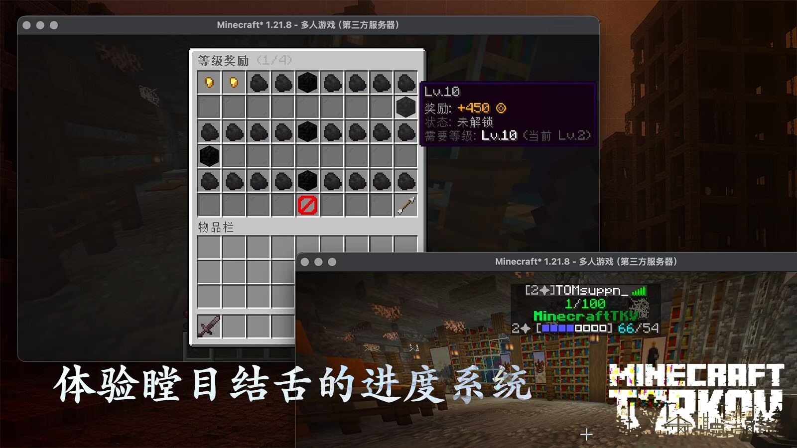
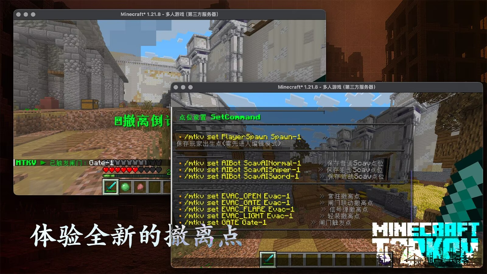

# 更新日志



## MinecraftTKV Alpha.1-rc.2-pre4

\[+] 新增轻装，信号弹，拉闸撤离点

\[+] 新增闸门（gate）可设置点位

\[+] 新增战局撤离点随机刷新逻辑

\[+] 新增经济系统，可转账，冻结，经济排行榜

\[+] 新增统计信息列表，玩家可以查看上一次战局和总统计数据

\[\~] 修复玩家在匹配中退出后无法重新开启匹配的问题

\[+] 新增进度系统和进度菜单，玩家可以通过获取经验值来升级获得货币奖励

\[+] 重制配置文件结构，以供适应新体系

<figure><figcaption></figcaption></figure> <figure><figcaption></figcaption></figure> <figure><figcaption></figcaption></figure>




## MinecraftTKV Alpha.1-rc.2-pre3


\[\~] 修复物资编辑器中物品卡死BUG\
\[+] 新增Scav命名池自定义配置\
\[+] 新增Tab菜单开关配置\
\[\~] 重构配置文件架构\
\[\~] 修复地图编辑器将点位设置在方块内部的bug\
\[\~] 修复撤离点对创造/旁观玩家生效\
\[+] 新增实验功能：PMC-BOT，当功能开启PMC玩家会在战局人数不足时自动补全空位。




## **MinecraftTKV Alpha.1-rc.2-pre2-hotfix2**


\[\~] 修复玩家在藏身处无限制使用/play命令的bug\
\[\~] 修复玩家在战局中开启新战局的bug\
\[+] 玩家在开局10s倒计时期间会获得免疫伤害的效果\
\[+] 玩家在藏身处时会获得免疫伤害的效果\
\[+] 玩家不能再通过退出游戏的方式脱离战局




## **MinecraftTKV Alpha.1-rc.2-pre1-260212**


\[+] 更新藏身处地图文件，加入可存放物品的箱子，工作台等拓展内容&#x20;

\[\~] 优化玩家进入队列的速度




## **MinecraftTKV Alpha.1-rc.2-pre1**


\[+] 多队列系统&#x20;

\[+] 玩家定位表：新增 PLAYER\_TO\_LOBBY&#x20;

\[+] 房间预占用：新增 RESERVED\_MATCH\_WORLDS&#x20;

\[+] SEARCHING → WAITING 自动迁移&#x20;

\[+] 分段计时机制&#x20;

\[+] 最大人数动态化&#x20;

\[+] BossBar 时间格式&#x20;

\[+] SEARCHING 扫光标题&#x20;

\[\~] 兼容性修复：扫光动画不再依赖 Bukkit.getCurrentTick()&#x20;

\[-] 移除旧等待机制&#x20;

\[-] 移除 SEARCHING 进度累积逻辑




## **MinecraftTKV Alpha.1-rc.1-fix3**


\[\~]调整TAB菜单样式:“MinecraftTKV”文字黄色扫光速度曲线调整为正弦函数&#x20;

\[\~]调整插件启动提示信息，删除冗余的debuglog&#x20;

\[\~]调整物资搜索菜单玻璃板颜色设置，加入区分暂停搜索和正在搜索的识别符；统一搜索提示文字为白色&#x20;

\[+]添加玩家通过点击正在搜索项目从而暂停搜索的功能&#x20;

\[\~]将物资搜索时间调整为1.3s～3.2s（原2.8s）；将尸体搜索时间调整为4.8s～8.7s（原5s），且搜索时间与尸体绑定 不同玩家搜索时间一致&#x20;

\[\~]Scav不再掉落战利品&#x20;

\[\~]修复物资编辑系统有关“最大刷新值”的文本显示不一致问题&#x20;

\[-]移除“正在等待玩家”的Bossbar&#x20;

\[-]移除匹配状态提示信息等众多Debug信息



